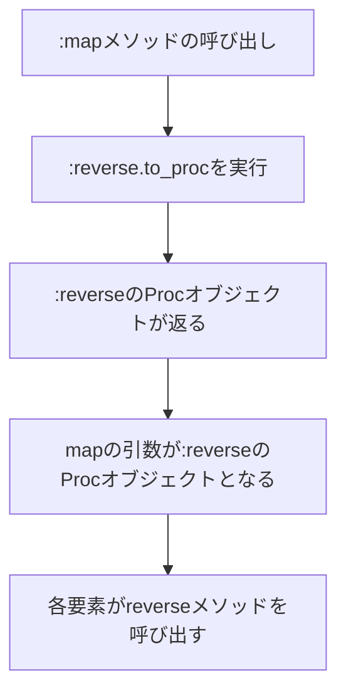

# はじめに
```rb
["abc", "123"].map(&:reverse)
```
Rubyではブロック付きメソッドにシンボルを渡すことができるみたい。
メソッドにシンボルを渡すときの処理が気になり、調べた結果をまとめておく。

# 動作環境
+ Ruby 3.1

# ブロック付きメソッドとは
> ブロック付きメソッドとは制御構造の抽象化のために用いられるメソッドです。（中略） do ... end または { ... } で囲まれたコードの断片 (ブロックと呼ばれる)を後ろに付けてメソッドを呼び出すと、そのメソッドの内部からブロックを評価できます
>
>  メソッド呼び出し(super・ブロック付き・yield) (Ruby 3.1 リファレンスマニュアル)

+ メソッドには**ブロック**を渡せるものがあり、この**ブロックが付随したメソッド**のことを**ブロック付きメソッド**という。
+ **ブロック**とは`do` ~ `end` や `{`~`}`で囲まれている処理のかたまりを表すもの。
+ `each`メソッドや`map`メソッドはブロックを受け取ることができるメソッドである。

### 記述方法
```rb:sample.rb
# do end を用いた書き方、ブロックが複数行の時によく使われる
result = ["abc", "123"].map do |text|
    text.reverse
end
p result

# {} を用いた書き方、ブロックが1行の時によく使われる
p ["abc", "123"].map {|text| text.reverse}

# シンボルを用いた書き方
p ["abc", "123"].map(&:reverse)
```
##### 出力
```bash
ruby sample.rb
# 上記の3つの書き方は同じ出力になる
["cba", "321"]
["cba", "321"]
["cba", "321"]
```
+ 上二つはブロックを渡しているが一番下は**シンボル**[^1]に`&`をつけて渡している。

# ブロック付きメソッドに渡せるもの
> to_proc メソッドを持つオブジェクトならば、`&' 修飾した引数として渡すことができます。（中略）to_proc はメソッド呼び出し時に実行され、Proc オブジェクトを返すことが期待されます。
>
>  メソッド呼び出し(super・ブロック付き・yield) (Ruby 3.1 リファレンスマニュアル)

+ つまり、**ブロック付きメソッドには`to_proc`メソッドを持つオブジェクトを渡すことが可能**である。
+ そして、**`Symbol`クラスは`to_proc`メソッドを持つ**ので、`map`メソッドには`&:reverse`として渡すことができる。

https://docs.ruby-lang.org/ja/3.1/class/Symbol.html#I_TO_PROC

### Procオブジェクト
> ブロックをコンテキスト(ローカル変数のスコープやスタックフレーム)とともにオブジェクト化した手続きオブジェクトです。
> Procクラス (Ruby 3.1 リファレンスマニュアル)

+ `Proc`オブジェクトとは簡単に言うと、ブロックをオブジェクト化したものである。

# ["abc", "123"].map(&:reverse)の処理
1. `map`メソッド呼び出し時に、引数であるシンボルオブジェクト`:reverse`の`to_proc`メソッドが実行(`:reverse.to_proc`)される。
2. `:reverse.to_proc`を実行すると`:reverse`の[`Proc`オブジェクトが返り値](https://docs.ruby-lang.org/ja/3.1/class/Symbol.html#I_TO_PROC)となる。そして、得られた`Proc`オブジェクトを`map`メソッドの引数として渡す。
3. `map`メソッドは配列の各要素に対して引数である`Proc`オブジェクトを呼び出す。
4. `Proc`オブジェクトを呼び出す（`Proc#call`）と、`Proc#call`の第一引数をレシーバ[^2]として、 自身の名前のメソッドを呼び出す。
5. つまり、各要素をレシーバとして、`reverse`メソッドを呼び出している。



# 補足
+ 私は`:メソッド名`とすると、宣言の時点である特定のメソッドのシンボルが作成されると思っていた。
+ そのため、別のクラスの同名メソッド(`Array`クラスの`reverse`メソッドと`String`クラスの`reverse`メソッド等)をどのように区別しているのかと疑問に思った。
+ 調べた結果をまとめておく。

```rb:sample.rb
rev = :reverse
p ["abc", "123"].map(&rev)
```
##### 出力
```bash
ruby sample.rb
["cba", "321"]
```
- 1行目の `rev = :reverse` で、`:reverse`というシンボルを作成し、変数 `rev` にそのシンボルを代入している。**この時点では特定のメソッドが直接関連しているわけではない**。
- 2行目の `["abc", "123"].map(&rev)` には、`&rev`は`rev`に代入されたシンボルを`Proc`オブジェクトに変換し、`map`メソッドにその`Proc`オブジェクトを渡している。
- このProcオブジェクトは各要素（このコードだと `"abc"` や `"123"` ）から呼び出されたときに`:reverse`と同じ名前のメソッド（このコードだと `String` クラスの `reverse` メソッド）を呼び出すものである。
- つまり、`rev`自体はシンボルであり、それが`&`演算子を使って`Proc`オブジェクトに変換され、その`Proc`オブジェクトが`map`メソッドに渡されている。そして、各要素に対して `reverse` メソッドが呼び出されることになる。

# おわりに
理解が間違っている点などあれば、コメントいただけると幸いです。
最後までお読みいただきありがとうございました！

[^1]: シンボルとは任意の文字列と一対一に対応するオブジェクトである。<br> :symbolのようなリテラルで得られる。
[^2]: レシーバとはメソッドを呼び出されるオブジェクトのことである。

# 参考
[ゼロからわかるRuby超入門](https://www.amazon.co.jp/dp/4297101238/ref=cm_sw_em_r_mt_dp_2VJW08DAWQJJ5XS10B5V)
https://docs.ruby-lang.org/ja/3.1/doc/spec=2fcall.html#block
https://docs.ruby-lang.org/ja/3.1/class/Proc.html
https://docs.ruby-lang.org/ja/3.1/class/Symbol.html#I_TO_PROC
https://zenn.dev/hayaokimura/articles/ruby-block-reintroduction
https://www.te-nu.com/entry/2022/09/20/180956